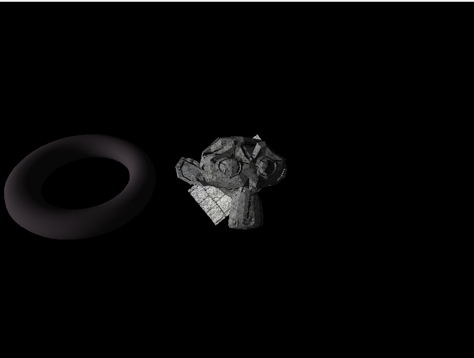
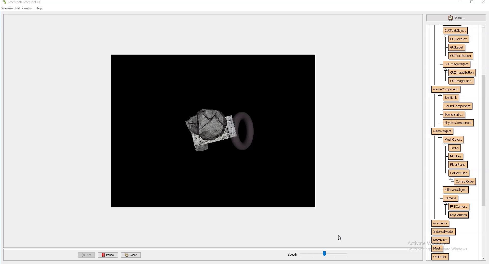
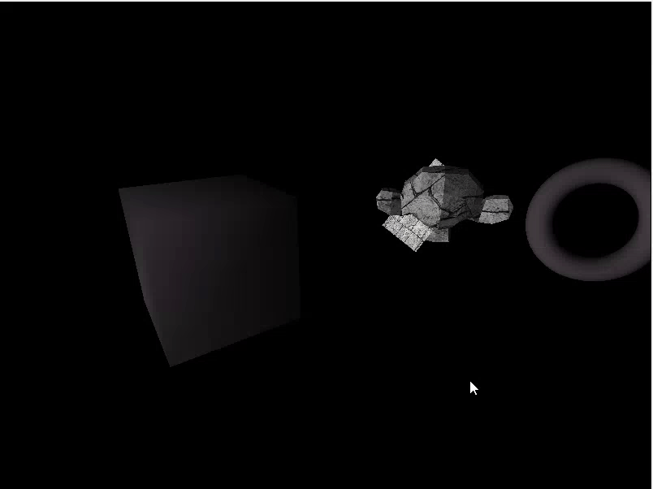

# Greenfoot3D
-------------

#### Description

A 3D Software renderer and miscellaneous game engine features built on top of the program Greenfoot.

#### Images

#### Background

Greenfoot3D is a 3D game engine built inside of Greenfoot, a very simple 2D game engine used for teaching students how to use the Java programming language.
It was originally created in 2015 during my Sophomore year of high school during which time I was taking a Java programming course where the students used Greenfoot.

#### Features

- Textured 3D Model Rendering
- Diffuse lighting (global directional ambient light)
- Texture Loading
- .obj model loading
- Raycasting against meshes
- Simple AABB collision detection

#### Usage

1. Install version 3.0.0 of Greenfoot, which is currently quite outdated as this project is very old
2. Install Java JDK 8, through testing, only the official JDK works with Greenfoot 3.0.0
3. Open project.greenfoot in Greenfoot
4. Click 'Run'

